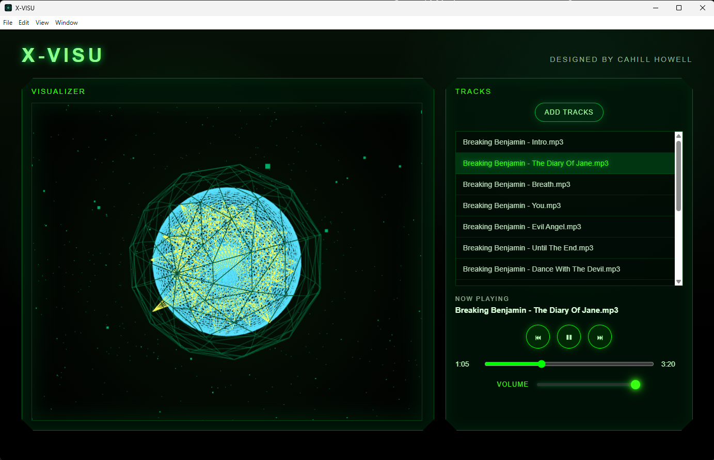

# X-VISU

A retro console-inspired music visualizer built with JavaScript, HTML5 Canvas, and the Web Audio API.
Inspired by my original xbox console. I attempted to make something in relativity to the media player within
the original xbox console.

Public build is now available. Please be aware, the application requires to you have available .mp3 files
in order to function. I have included some copyright free files within this repo for you to test the application.
You will find them in the public folder.

All feedback welcome!

## Preview - Version 1.0.0

## Features

- Audio-reactive circular visualizer
- Dynamic particle background
- Audio controls
- Responive visual animation
- Real-time frequency analysis

## Tech Stack

- JavaScript
- HTML5 Canvas
- CSS
- Web Audio API

## Future Plans

- Requires more creativity
- Always in progress