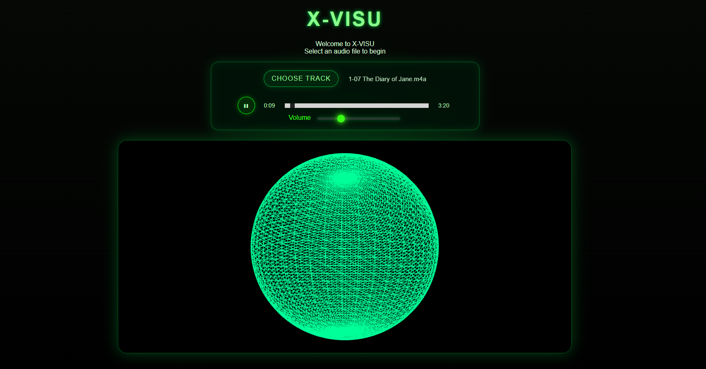

# X-VISU

A retro console-inspired music visualizer built with JavaScript, HTML5 Canvas, and the Web Audio API.

## Preview - Version 0.2.0

## Features

- Audio-reactive circular visualizer
- Dynamic wireframe background
- Custom playback controls
- Glowing orb animation
- Real-time frequency analysis

## Tech Stack

- JavaScript
- HTML5 Canvas
- CSS
- Web Audio API

## Future Plans

- Electron desktop build
- Three.js 3D renderer
- Playlist support
- Particle systems
- Visualizer presets